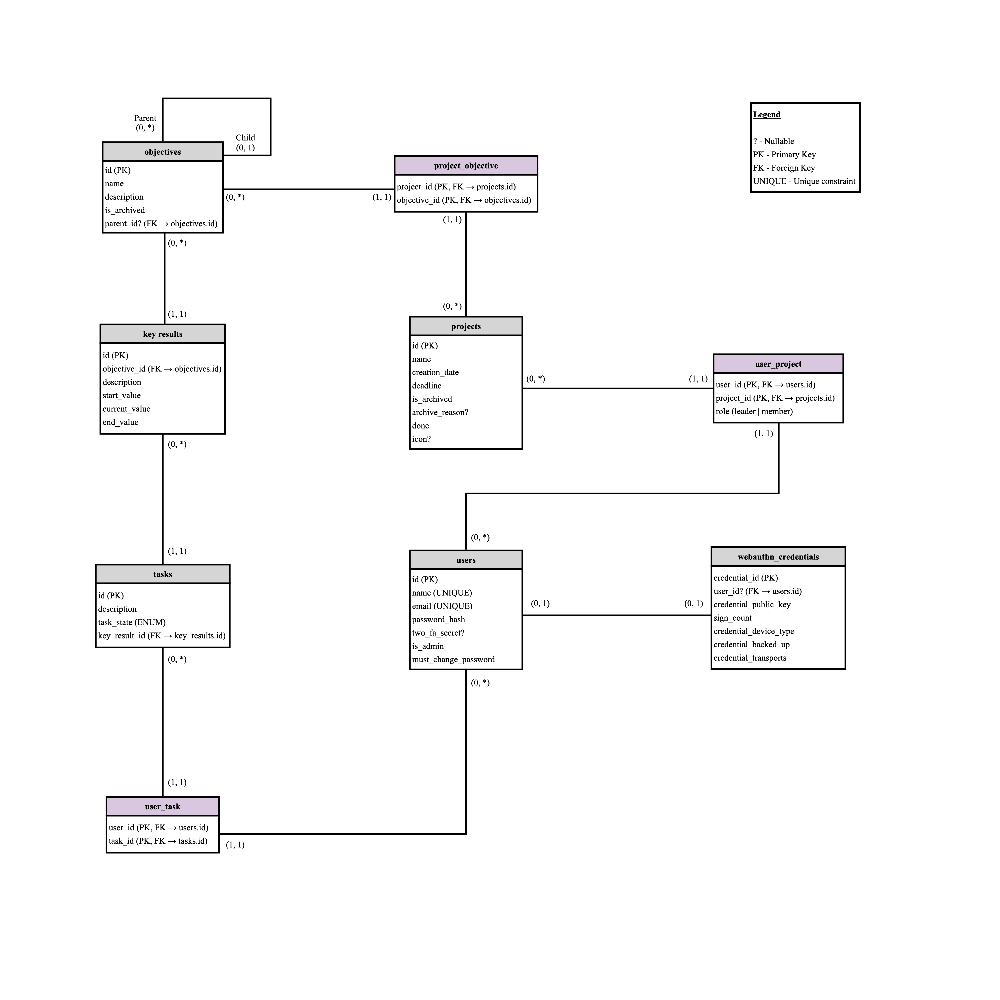

Database diagram
----------------
This diagram represents the logical database schema of the OKR system.
It visualizes the main tables, their attributes, primary and foreign keys, and their relationships using min–max cardinality notation.

The min–max notation describes how many instances of one entity may be associated with a single instance of another entity.
For example:

- (1,1) means exactly one
- (0,1) means zero or one
- (0,*) means zero to many

The diagram reflects database-level constraints (primary keys, foreign keys, and nullability).
Additional restrictions may be enforced at the application layer (e.g., in app.py) and are not necessarily guaranteed by database constraints.

   Logical database schema of the OKR system using min–max notation.