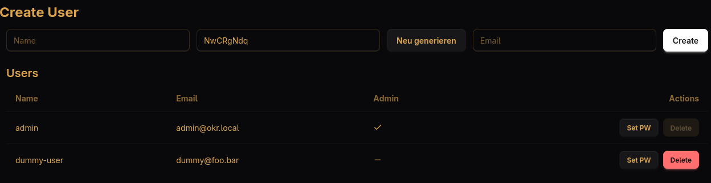

Maintenance
-----------
There are two ways to create new users or reset their passwords.

Via the web UI
""""""""""""""
After logging in, the admin user can manage users via the `Users` section in the navigation bar.

After creating a new user, you should note down the user's password and send the login data (username, email, password) to them. When the user logs in for the first time, they are asked to change their password immediately.

Using maintenance scripts
"""""""""""""""""""""""""
The app comes with a maintenance script that allows you to do the same admin actions as with the web interface.

.. hint:: If you installed the app via docker, you first have to ``chroot`` in the running docker container by executing
   ::
      docker exec -it okr-backend /bin/sh

Create users
~~~~~~~~~~~~
You can create new users by running

.. code-block:: sh

   ./maintenance_script.py add-user "username" "email@example.com" "password"

Reset passwords
~~~~~~~~~~~~~~~
You can reset passwords by running

.. code-block:: sh

   ./maintenance_script.py reset-password "username" "new-password"

This also removes the 2FA settings the user previously configured (e.g. TOTP or Webauthn).

Generate password hashes
~~~~~~~~~~~~~~~~~~~~~~~~
You can reset passwords by running

.. code-block:: sh

   ./maintenance_script.py hash-password "password"

Delete users
~~~~~~~~~~~~
You can delete an existing user by running

.. code-block:: sh

   ./maintenance_script.py delete-user "username"
