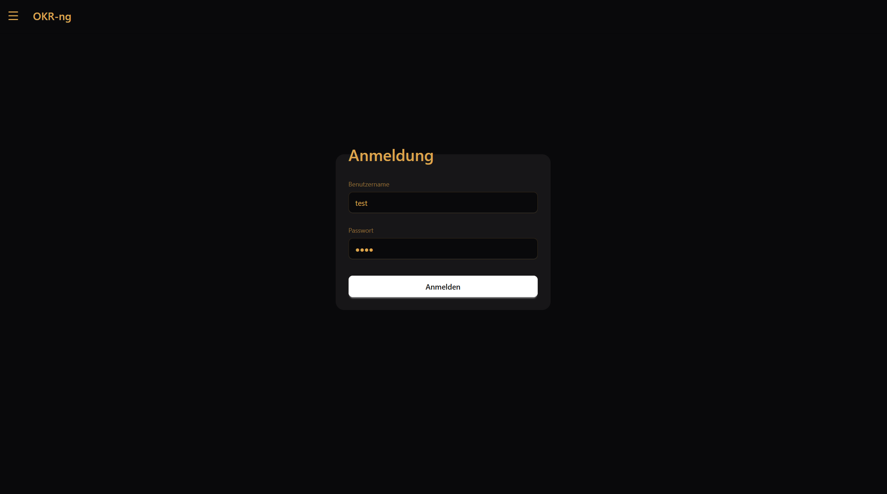
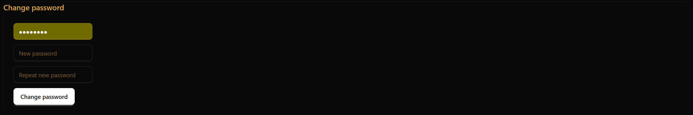
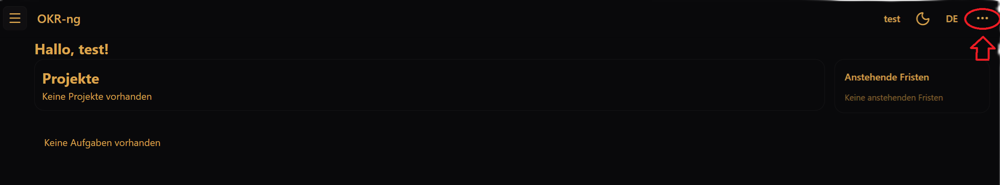

Getting started
===============

What you need
-------------

To use the OKR tool, you need:

- the URL of your OKR instance
- your username
- your initial password

Accounts are usually created by an administrator.
On your first login, you may be required to change your password.

First login
-----------

1. Open the OKR tool in your browser.
2. Enter your username and password.
3. Confirm the login.

If your account is marked for a password change, the tool will ask you to choose a new password before you continue.

After login
-----------

After a successful login, you land on the dashboard.
This is your starting point in the tool.

From there, you can:

- open your projects
- check upcoming deadlines
- review your assigned tasks
- open your account settings

Your next step in the documentation should be :doc:`navigation`, which explains the main areas of the interface.

Logging out
-----------

To log out, open the **⋯ (More)** menu in the top-right corner and select **Log out**
(or **Abmelden**, depending on the UI language).

