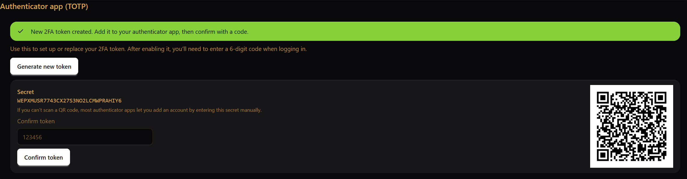
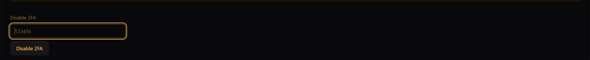

Getting started
===============

What you need
-------------

You need:

- the URL of your OKR instance
- a username and an initial password

Typically, accounts are created by an administrator. On your first login you will be prompted to change your password.

Login and logout
----------------

1. Open the OKR tool in your browser.

2. Log in with your username and password.

   .. figure:: _images/sign_in.png
      :alt: Sign-in screen
      :width: 900px

3. On your first login, change your password when prompted.

4. To log out, open the ⋯ (More) menu in the top right corner and select Log out
   (or Abmelden, depending on the UI language).

   .. figure:: _images/logout.png
      :alt: Top right menu with logout option
      :width: 900px

Two-factor authentication (2FA)
-------------------------------
Depending on how your instance is configured, you may be able to enable two-factor authentication (2FA) using TOTP.

If an administrator resets your password, your existing 2FA setup may be removed and you will need to configure it again.

Enable 2FA
~~~~~~~~~~

To enable 2FA, open the **⋯ (More)** menu in the top right corner and select **Account**.
Create a new token, then add the shown secret to your authenticator app either by entering the secret key manually
or by scanning the QR code. Finally, confirm the token in the UI to complete the setup.

Disable 2FA
~~~~~~~~~~~

To disable 2FA, enter a valid TOTP code in the 2FA deactivation field and confirm.

Passkeys (WebAuthn)
-------------------

To register a passkey, open **⋯ (More)** → **Account** and click **Register passkey** in the
**Passkeys (WebAuthn)** section. Your browser will then show a system dialog.

On Windows, this dialog is called **Windows Security** and asks to save a *passkey* (German UI: *Hauptschlüssel*)
for the current site (e.g., ``localhost``). Click **Continue** (German: **Weiter**) and follow the prompt
(e.g. PIN).

Once the flow completes, the passkey is stored on your device and can be used as a second factor when signing in.

Practical advice:

- Registering at least one backup option (another passkey or keeping TOTP enabled) helps avoid lockouts if you lose a device.
- WebAuthn availability depends on browser and device support.

Password resets
---------------

To change your password, open **⋯ (More)** → **Account**. Enter your current password, then choose a new password
and repeat it for confirmation. Click **Change password** to apply the change.

This allows users to update their password without administrator support.

.. figure:: _images/change_password.png