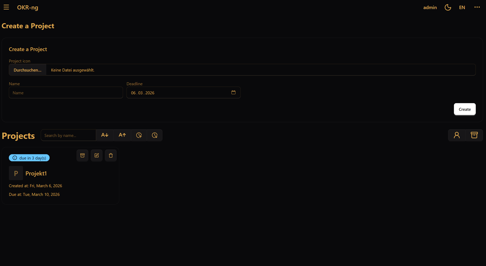
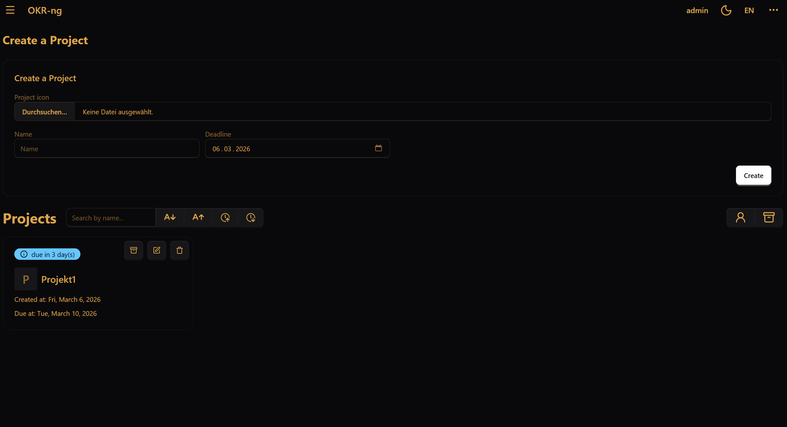

Navigate the interface
======================

This page gives you a quick orientation after login.
The exact layout may differ slightly depending on your version and screen size,
but the basic flow stays the same.

Dashboard
---------

The dashboard is the main entry point after login.
It gives you a compact overview of your work.

You will usually find these areas there:

- **Projects**: open one of your projects to work on its objectives, key results, and tasks
- **Upcoming deadlines**: see which project deadlines are approaching
- **Your tasks**: check what is currently assigned to you
- **Top-right menu**: open account settings or log out

A practical way to use the dashboard is:

1. Check whether you have urgent tasks.
2. Open the project you want to work on.
3. Update progress or task states before leaving the tool.

Opening a project
-----------------

When you open a project, you move from the general overview into the actual OKR workspace.
A project page typically contains:

- the project name
- members of the project and their roles
- the list of linked objectives
- project-management actions for team leads

Where to find account actions
-----------------------------

Open the **⋯ (More)** menu in the top-right corner if you want to:

- open your account page
- change your password
- manage login security features
- log out

For details about passwords, 2FA, and passkeys, see :doc:`account-security`.

Typical navigation path
-----------------------

A new user will usually move through the tool in this order:

1. Log in
2. Open the dashboard
3. Open a project
4. Inspect objectives and key results
5. Update progress or task states
6. Return to the dashboard or log out
