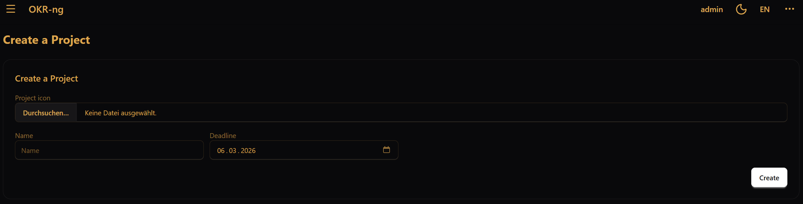
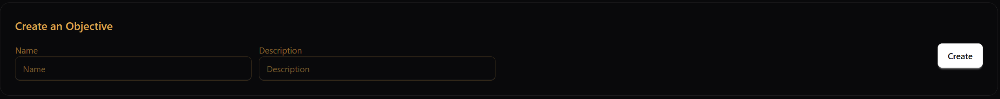
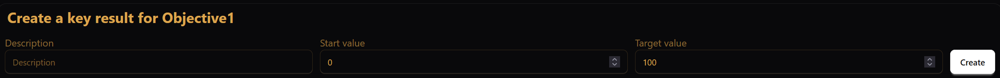
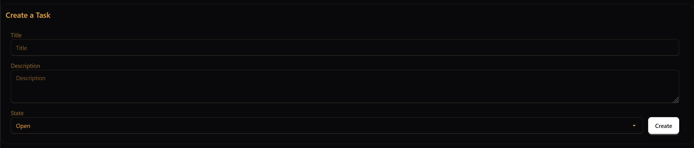

Work in a project
=================

This page explains the typical day-to-day workflow inside a project.
Not every user creates projects, but most users will work with objectives,
key results, and tasks.

Projects
--------

A project is the container for your OKR work.
It usually has:

- a name
- a deadline
- a status such as done or not done
- linked objectives

Creating or changing the project itself is usually a team-lead task.

To create a project go to projects and create it there.

Objectives
----------

An objective describes what you want to achieve.
Objectives can also be nested, which means one objective can have child objectives.

In practice, objectives answer the question:

**What are we trying to accomplish?**

To create an objective go into the Project for which you want to create the objective and create it there. 
You can also link sub-objectives to an objective in the current objective you are in. To do that you need to create an objective in another project and link it to that objective. 

Key results
-----------

A key result makes an objective measurable.
Each key result has:

- a start value
- a current value
- an end value

In practice, key results answer the question:

**How do we measure whether we are getting there?**

To create a key result go into the objective for which you want to create the key result and create it there.

Updating progress
~~~~~~~~~~~~~~~~~

To track progress, update the **current value** of a key result.
The current value must stay within the range between the start value and the end value,
inclusive. If it falls outside that range, the update is rejected.

Tasks
-----

Tasks are concrete action items under a key result.
They help translate a measurable result into day-to-day work.

A task has a description and a state.
Available task states are:

- ``open``
- ``planned``
- ``in_progress``
- ``done``
- ``cancelled``

A good working pattern is:

- create tasks when you create the key result
- keep task states up to date during the week
- use key-result values for measurable progress
- use tasks for concrete execution work

To create a task go into the key result for which you want to create the task and create it there. 

When is a project finished?
---------------------------

A project is usually finished when its work is complete and it is marked as **done**.
Whether you can do that yourself depends on your project role.

For role-specific permissions, see :doc:`projects-and-roles`.
